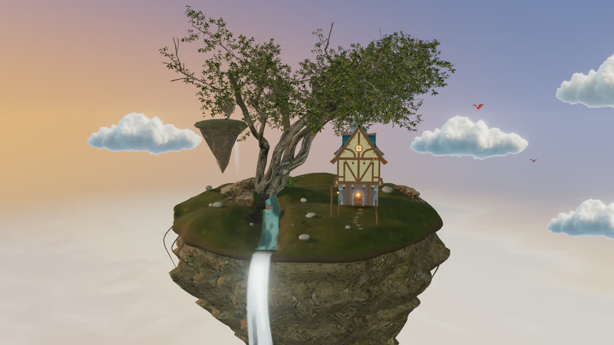
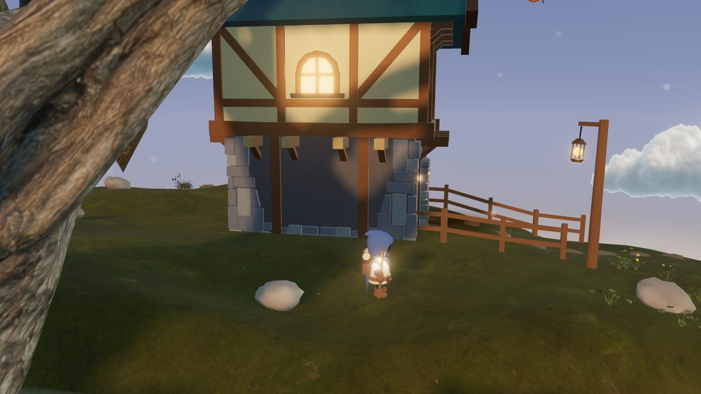
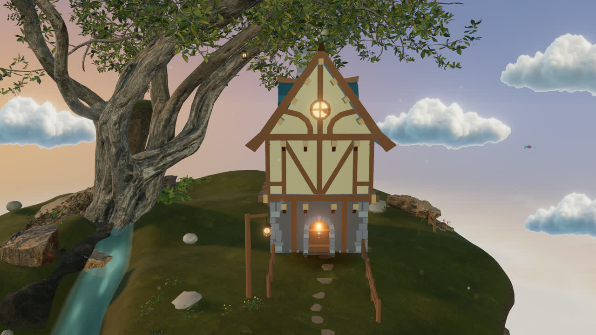
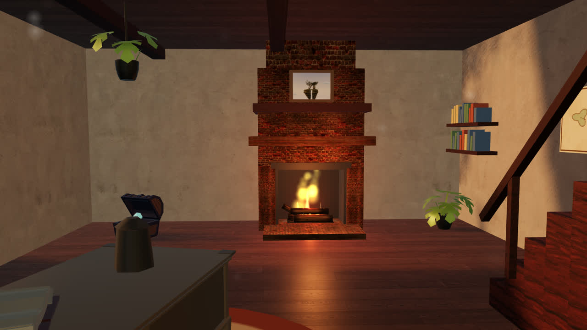

# Aetheria

*A little world above the clouds.*

**[Visit the island →](https://floating-island.mohdhaneenpk666.workers.dev)**



A cinematic floating island you can fly to, walk across, and step inside —
built with Three.js and TypeScript, and rendered in the browser with no game
engine underneath it. The terrain is generated, the river is carved, the
cottage is enterable, and the fire in its hearth is the brightest thing in the
room.

Best on a desktop or laptop: it asks for a mouse to look, a keyboard to walk,
and a graphics card to hold up the sky. Handheld visitors are met with a still
of the island and an explanation rather than a world they cannot steer.

---

## Someone lives here



A hooded traveler waits in the meadow. Press <kbd>E</kbd> and the camera comes
down over their shoulder — <kbd>W</kbd><kbd>A</kbd><kbd>S</kbd><kbd>D</kbd> to
walk, <kbd>Shift</kbd> to run, <kbd>Space</kbd> to jump, the mouse to look.
<kbd>Esc</kbd> hands the island back to the scroll journey; both directions
travel rather than cut.

**Faceless, and meant to be.** The face is not hidden or shadowed — it is
removed from the mesh. Every triangle on the head was sampled against the
character sheet and the ones that came back skin, brow or eye were dropped, 445
of them, leaving 328 of hood cloth with an unlit form beneath. There is no
lighting condition under which a feature can appear, because the geometry is
not there.

**Dressed by rewriting the sheet.** The costume samples one palette laid out as
a grid of flat gradients, one cell per surface, so each cell can be moved onto
a new colour while keeping its own shading — the pack's green became the blue
of the hood and cloak, the tunic cream, the fittings brass. A tint could never
have managed it: green has no blue in it to scale. The staff, lantern, pack and
bedroll are built from primitives.

The model is CC0 and 0.52 MB, down from 3.43 — 71 of its 76 animation clips are
gone, along with everything they referenced. See
[SOURCE.txt](public/assets/models/traveler/SOURCE.txt).

## The world

|  |  |
| --- | --- |
|  |  |

**Generated, not modelled.** The island comes out of seeded noise — the same
seed always builds the same island — with a river carved through the meadow,
waterfalls stepping off the rim, and hanging roots beneath the rock. Every tree,
stone and flower is placed by a surface sampler with its own rules per category,
so nothing is positioned by hand and nothing floats.

**A day that behaves like one.** Golden hour is one-sided: the horizon burns
honey where the sun sits and stays dusk-blue behind you. Sister islands drift in
the haze, cloud shadows cross the grass, and pollen catches the light.

**Ground that pushes back.** The cottage, the tree and the fence stop you, and
what is solid is measured off the thing itself rather than guessed at: the
cottage from its own vertices turned back through its yaw, the tree as one
collider per bole, the fence as line segments the garden records while building
them. Rocks are not blocked at all — they are stood on, so a shelf is climbed
rather than walked through.

**A cottage you can enter.** Walk to the door, press <kbd>E</kbd>, and you are
inside in first person: two storeys, a staircase to a loft, a round window
looking back at the great tree, and furniture that stops you walking through it.
The hearth burns with shader flames, embers, rising sparks and smoke, and
crackles louder as you approach it. Leaving puts you back on the traveler's
feet, outside.

**The room is the menu.** The book tells the island's story. The map's four
places answer the pointer with the Keeper's note for somewhere you can actually
walk to. The painting opens a gallery you step through a plate at a time. And
the crystal has stopped saying *coming soon* — it types out one of seven
answers, a different one each visit, and explains nothing.

## Controls

| | |
| --- | --- |
| Scroll | travel the island, cinematically |
| <kbd>E</kbd> | walk with the traveler, enter the cottage, read what is inside it |
| <kbd>W</kbd><kbd>A</kbd><kbd>S</kbd><kbd>D</kbd> | walk |
| <kbd>Shift</kbd> | run |
| <kbd>Space</kbd> | jump |
| Mouse | look around |
| <kbd>M</kbd> | sound, without letting go of the mouse |
| <kbd>Esc</kbd> | let go — back to the scroll journey |

## Running it

```bash
npm install
npm run dev          # http://localhost:3000
npm run dev:host     # same, reachable from another machine on the network
npm run build        # type-check, bundle, and drop unserved assets
npm run preview      # serve the built output exactly as the host will
```

Node 22 or newer.

## How it is put together

```
src/
  core/         renderer, loop, quality tiers, performance watchdog
  camera/       the landing, fly-in, scroll journey, third-person and interior
  scene/
    islands/    terrain generation, the height field everything is placed on
    character/  the traveler, their walk, and how they are dressed
    composition/  what stands where, and what you cannot walk through
    interior/   the room, its hearth, its furniture
    environment/  sky, cloud sea, distant islets
    water/      river and waterfalls
  interaction/  what is in reach, from which side, and what E does about it
  ui/           landing, nav, storybook panels, the handheld doorway
scripts/        asset preparation: LODs, texture compression, model surgery
```

**One source of truth for the ground.** `IslandSurface` answers "how high is the
land here, and which way does it face" — the river carve, the mounds and the
levelled pads included. Everything placed on the island asks it rather than
carrying a hardcoded height, which is why nothing hovers or sinks when the
terrain changes. The traveler asks it on every step.

**Reach is measured from the visitor.** Outdoors the camera trails several units
behind the traveler's shoulder, so range is measured from them rather than from
it — and a thing can declare which side it may be used from, which is why the
cottage door is answered from its own step and not through the back wall.

**Quality decides itself.** The renderer, texture sizes, model LODs, shadow maps
and post-processing are chosen from the visitor's GPU, and a frame-rate watchdog
eases the detail down within seconds if the machine cannot hold it — saying so
rather than quietly coming back different. A **detail** toggle in the nav
overrides both, and a hand-picked tier is never second-guessed. The plainer tier
also thins the hearth's flame sheets and its faintest lamps, which is where the
frames actually go indoors.

**Weight is measured, not guessed.** Every asset the site requests is recorded
across both tiers and the whole experience; the textures are compressed against
that measurement, and the build drops what nothing asks for. A visit costs
46–73 MB depending on tier, with the returning visitor paying almost nothing.

## Credits

Every external asset is CC0 or equivalent, and recorded in a `SOURCE.txt`
beside it. The traveler is KayKit's, the cottage and its furniture Quaternius',
the rock and foliage scans Poly Haven's, the birds mirada's (CC-BY, credited
in the story panel), sound from Mixkit, and the type is Cinzel by Natanael
Gama.
